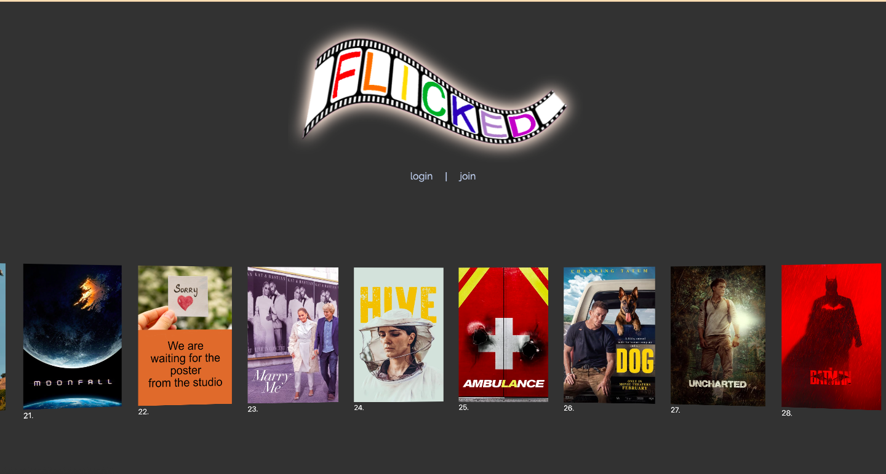

## Movie Scheduler - Flicked
https://flick3d.herokuapp.com/

### Table of Contents  
  
   1. [Project Description](#1-description)
   2. [Technology Used](#2-technology)
   3. [Application Features](#3-features)
   4. [Installation](#4-installation)
   5. [Usage](#5-usage)
   6. [Credits](#6-credits)
   7. [License](#7-license)
   8. [Repository Status](#8-github-repo-status)
   9. [Contribute](#9-how-to-contribute)
   10. [Tests](#10-tests)
   11. [Checklist](#11-checklist)

---
### 1. Description  
**What is this project?**  
* An application for users to join and view new release movies including their release date.  

**Why this project?**  
* Movie releases are hard to track sometimes without accessing movie industry news, one example is Avatar 2 that has been promised for a number of years and is now scheduled for release in Dec-2022.  This application provides movie lovers with a convenient tool to quickly get updated with scheduled release dates for movies in the next 12 months.

**What problem does this project solve?**  
* Users who want the convenience of seeing all scheduled release dates for movies so they can diarise or prepare to see it when released.

**Lessons learnt?**  

A few ideas for this project proved challenging at this moment in time and would be great additions to the site in the future.  
- Some issues with the use of calling in data was noticed as it showed listings for already released movies which had to be manually overwritten.  

- Nodemailer is a useful module but proved difficult for the purposes of the app. It would require a good deal amount of coding to make use of the several preferences users can apply.  

- Using branches further has been helpful in finding out the best way in order to streamline tasks and avoid conflicts.  

- Certain design elements have been used which allow for greater function of the site. Using these in the future will help greatly in formatting a mobile first page.
---
### 2. Technology

- Heroku
- MySQL
- Express.js
- Node.js
- Sequelize
- NodeMailer
- GSAP
- Bcrypt

### 3. Features  
* Site hosted on heroku 
https://flick3d.herokuapp.com/

Features provided:

* View upcoming films in a carousel feature

* On first load, users are taken to a login page via the button in navbar or through clicking one of the movie posters.  If not a member, they are asked if they would like to sign up and provide details there to create a user profile.  

* Users are able to view a movie after clicking to see film info including a film poster, title, synopsis and genre

* Users are able to add a film to a saved watchlist of upcoming movies

* Users can add settings to be able to be notified of the movie closer to the date of release

* Users can view a list of saved movies in the dashboard page.  Here they can click through to see the movie page once again.  

* Users can delete movies in the watchlist if no longer interested in viewing them.
  
#### Screengrab

 

---
### 4. Installation  
You can download the source code from [my Github repository](https://github.com/Mark33Mark/movie-scheduler) and unzip the files to a location on your computer. 

---

### 5. Usage  
* The code can be downloaded from [my Github repository](https://github.com/Mark33Mark/movie-scheduler) for all assets created for the project.  
You can modify the code as you need.

* Site hosted on Heroku
https://flick3d.herokuapp.com/

---
### 6. Credits  
There are no particular call outs for this assignment, all code was used with reference to the unit 14 Activities.

---
### 7. License  
 The works in this repository are subject to:  

---
### 8. Contributers  
[Konnen Hannaford](https://github.com/konnenhannaford)

[Zachary Hobba](https://github.com/HobbaZ)

[Mark Watson](https://github.com/Mark33Mark)

You can contribute by opening a pull request or submitting an issue.

---
### 9. How to Contribute
 If you would like to contribute, please comply with the Contributor Covenant Code of Conduct:  

---
### 10. Tests  
- No unit tests have been prepared for this project.  Testing done on my desktop running different scenarios.  A problem exists causing the application to glitch when trying to change an employee after deleting their manager.  Needs to be resolved.

---
### 11. Checklist  
 All actions not checked are still to be completed:

 [x]  GitHub repository containing your application code.  
 [x]  Application connects to a MySQL database using MySQL2 and Sequelize packages.
 [x]  Sensitive data is stored using environment variables through the use of dotenv package.  
 [x]  Application syncs Sequelize models to a MySQL database when the server starts.  
 [x]  Application includes column definitions and model associations for all four models outlined in the homework instructions.
 [x]  The GitHub repository contains all the application code.  
 [x]  Repository has a unique name; follows best practice for file structure; and naming conventions.  
 [x]  The application resembles the mock-up functionality provided in the assigment instructions.  
 [x]  Repository follows best practices for class/id naming conventions, indentation, quality comments, etc.  
 [x]  Repository contains multiple descriptive commit messages.  
 [x]  Repository contains a README file with description, screenshot and link to deployed application.  

---

- [Back to the top](#usyd-fsf-week14-project)